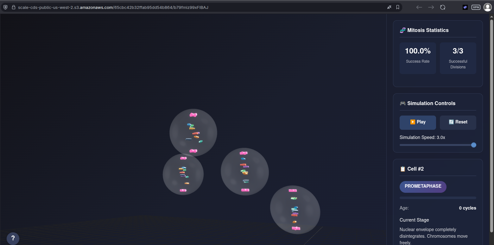

# Immersive Mitosis Lab

<p align="center">
  
  
  
</p>

<br>

<p align="center">
  <a href="https://scale-cds-public-us-west-2.s3.amazonaws.com/65cbc42b32ffab95dd54b864/b79fmiz99xFIBAJ">
    
  </a>
  <br>
  <em>An interactive 3D simulation of cellular mitosis.</em>
</p>

> **Note:** Replace the placeholder above with a high-quality screenshot or GIF of the application.

## About The Project

Immersive Mitosis Lab is a self-contained React component that provides a visually rich, interactive 3D simulation of the cell division process. Built with **React Three Fiber** and **Next.js**, it offers an educational and dynamic experience, allowing users to observe cells progressing through the different stages of mitosis in a beautifully rendered environment.

[**Live Demo »**](<your-live-demo-url-here>)

---

### Key Features

*   🔬 **Interactive 3D Canvas:** Explore the simulation in 3D space with orbit controls (pan, zoom, rotate).
*   🧬 **Accurate Mitosis Stages:** Watch cells transition from Interphase through Prophase, Metaphase, Anaphase, Telophase, and finally Cytokinesis.
*   🎮 **Simulation Controls:** Play, pause, reset the simulation, and adjust the playback speed.
*   📊 **Live Analytics:** A simple dashboard tracks the success rate and total number of cell divisions.
*   ℹ️ **Detailed Information:** Click on any cell to view its current stage, progress, age, and a description of the biological process.
*   🎓 **Educational Tooltip:** An easily accessible guide explains the fundamentals of mitosis and its stages.

---

### Built With

The project leverages a modern web technology stack to create a smooth and performant 3D experience in the browser.

*   [React](https://react.dev/)
*   [Next.js](https://nextjs.org/)
*   [Three.js](https://threejs.org/)
*   [React Three Fiber](https://docs.pmnd.rs/react-three-fiber/getting-started/introduction)
*   [React Three Drei](https://github.com/pmndrs/drei)

---

## Getting Started

To get a local copy up and running, follow these simple steps.

### Prerequisites

Make sure you have Node.js and npm (or yarn) installed on your machine.

*   `npm`
    ```sh
    npm install npm@latest -g
    ```

### Installation

1.  Clone the repository:
    ```sh
    git clone https://github.com/your-username/your-repo-name.git
    ```
2.  Navigate to the project directory:
    ```sh
    cd your-repo-name
    ```
3.  Install NPM packages:
    ```sh
    npm install
    ```
4.  Run the development server:
    ```sh
    npm run dev
    ```

Open [http://localhost:3000](http://localhost:3000) with your browser to see the result.

---

## How It Works

The entire application is encapsulated within a single, self-contained React component, `ImmersiveMitosisLab.tsx`. This file logically separates concerns into distinct sub-components:

*   **3D Scene Components:** `EnhancedCell`, `Chromosome`, `CellMembrane`, `SpindleApparatus`, etc., handle the visual representation and animation logic within the Three.js canvas.
*   **UI Panel Components:** `AdvancedControlsPanel`, `CellInformationPanel`, and `SimplifiedAnalyticsPanel` render the 2D user interface for controlling and monitoring the simulation.
*   **State Management:** React hooks (`useState`, `useEffect`, `useRef`, `useCallback`) manage the simulation's state, including cell data, user interactions, and the main animation loop.

This architecture makes the project highly portable and easy to integrate into other Next.js or React applications.

---

## License

Distributed under the MIT License. See `LICENSE` for more information.